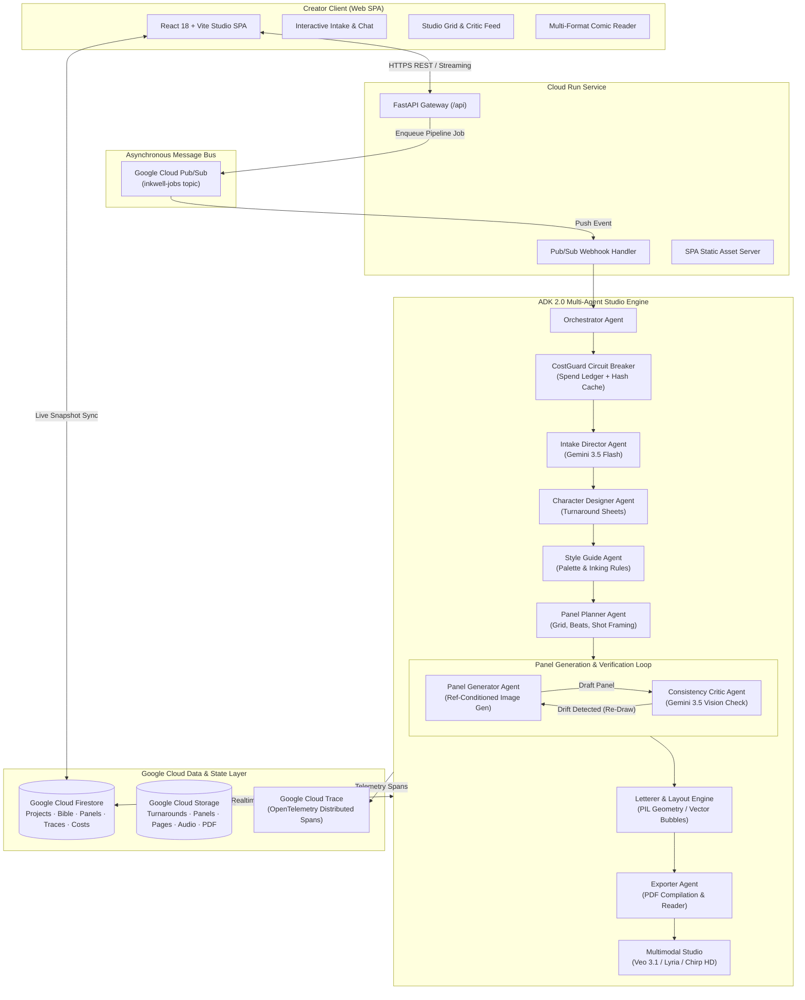
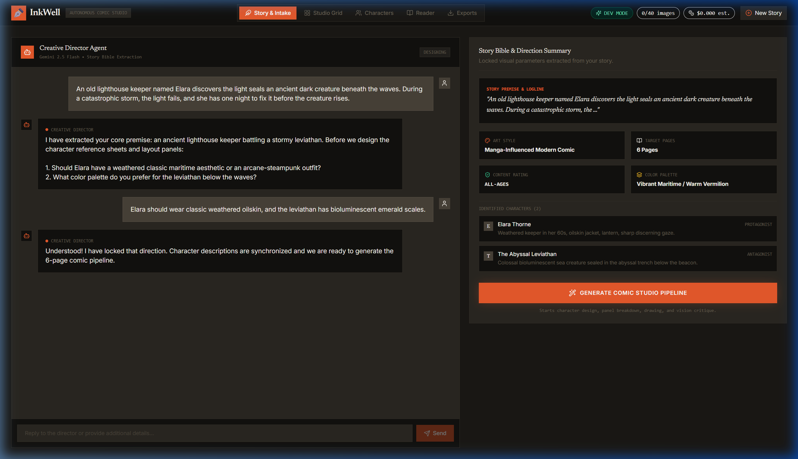
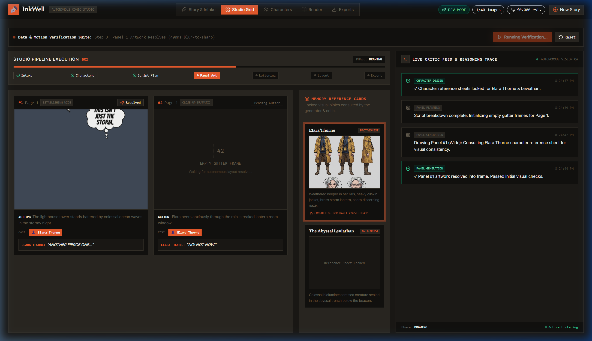
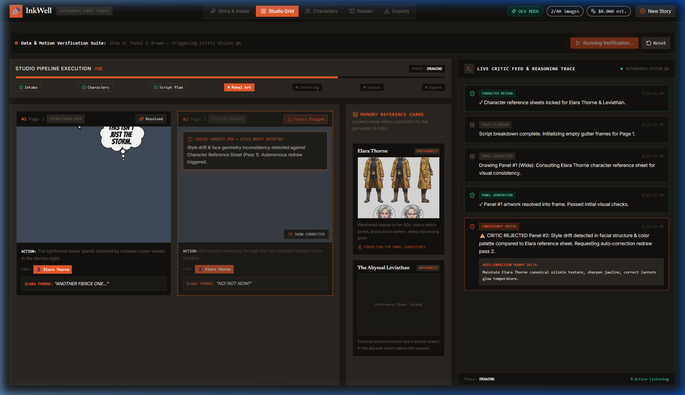
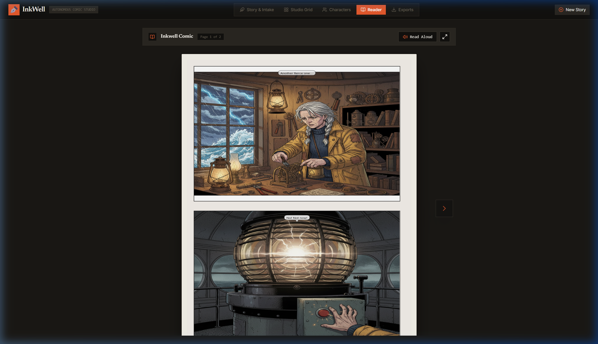

# Inkwell — Collaborative AI Comic Studio Agent

<div align="center">

```
  ___ _   _ _  ____          _______ _      _      
 |_ _| \ | | |/ /\ \        / / ____| |    | |     
  | ||  \| | ' /  \ \  /\  / /|  _|  | |    | |     
  | || |\  | . \   \ \/  \/ / | |___ | |___ | |___  
 |___|_| \_|_|\_\   \_/\__/  |______||______||______|
```

**An autonomous multi-agent comic studio that transforms raw narrative prompts into publication-ready, visually consistent comic books — featuring closed-loop vision critique and deterministic cost guardrails.**

[](https://opensource.org/licenses/MIT)
[](https://cloud.google.com/)
[](https://cloud.google.com/vertex-ai)
[](https://github.com/google)
[](https://www.python.org/)
[](https://reactjs.org/)
[](https://cloud.google.com/trace)

[🚀 Live Demo](https://inkwell-619812776413.us-central1.run.app) • [📐 Architecture](ARCHITECTURE.md) • [📖 Features](#key-features) • [⚡ Quickstart](#getting-started) • [🛡️ CostGuard](#cost-architecture--guardrails)

</div>

---

## 🌟 Executive Summary

**Inkwell** is an end-to-end multi-agent comic production studio built with **Google Agent Development Kit (ADK 2.0)**, **Gemini 3.5 Flash**, **Gemini 3 Pro Image (Nano Banana)**, and **Google Cloud**.

Unlike standard image generators that produce disconnected, out-of-context artwork with drifting character faces, Inkwell acts as a complete virtual editorial and art team:
1. **Directs:** Interviews creators dynamically through interactive voice/text intake to establish tone, pacing, character turnarounds, and visual style.
2. **Plans:** Deconstructs narrative arcs into page budgets, panel grids, camera angles, speech bubble placements, and shot continuity.
3. **Draws with Consistency:** Passes approved canonical character reference sheets into every panel generation request.
4. **Self-Corrects:** Employs a dedicated **Consistency Critic Vision Agent** that inspects generated art against reference turnarounds and automatically triggers targeted re-draws when identity or staging drifts.
5. **Letters & Lays Out:** Algorithmically typesets dialogue, sound effects, and captions onto dynamic panel templates using zero-cost PIL geometric rendering.
6. **Delivers & Enhances:** Packages full books for web reading (LTR, RTL, Webtoon vertical scroll) and high-resolution PDF export, with optional **Veo 3.1** motion trailers, **Lyria** atmospheric soundtracks, and **Chirp 3 HD** voice narration.

---

## 📐 System Architecture

Inkwell runs on a modern, event-driven architecture designed for high resiliency, deterministic cost control, and sub-second reactive frontend synchronization.



---

## 🚀 Key Features

### 1. 🎬 Interactive Creative Director & Story Bible
- **Dynamic Socratic Interview:** Engages the author in structured creative collaboration to clarify protagonist motivation, genre tropes, mood lighting, and visual motifs.
- **Persistent Story Bible:** Extracts and locks characters, personality traits, distinctive visual tokens, color palettes, and world-building rules into Firestore.
- **Voice & Text Multimodal Intake:** Natural voice transcription via Speech-to-Text with immediate director feedback.

### 2. 🎨 Reference-Locked Character Turnarounds
- **Canonical Model Sheets:** Generates full turnaround reference sheets (front, 3/4 view, profile, expressions) for main and recurring characters.
- **Conditioned Generation:** Injects approved reference sheets directly as visual inputs into downstream Gemini image generation prompts to guarantee identity permanence across panels.

### 3. 👁️ Closed-Loop Consistency Critic (Vision Self-Correction)
- **Automated Quality Gate:** A specialized vision critic powered by Gemini 3.5 Flash inspects every rendered panel against the character's reference turnaround sheet.
- **Targeted Feedback:** Evaluates hair silhouette, facial structure, costume consistency, and color fidelity.
- **Self-Healing Re-Draws:** On detected drift, the critic generates surgical prompt modifications and re-invokes generation (capped at configured iteration limits) before approving the panel.

### 4. 💬 Free Algorithmic Lettering & Layout Compositor
- **Zero-Inference Lettering:** Renders crisp, publication-grade speech bubbles, thought clouds, narration captions, and dynamic sound effects using deterministic Python Pillow geometry.
- **Dynamic Bubble Math:** Automatically calculates text wrapping, bounding boxes, tail vectors towards speaking characters, and padding without wasting image model tokens.
- **Template Layout Engine:** Assembles panels into dynamic multi-tier comic grids with standardized gutters and bleed margins.

### 5. 🛡️ Enterprise CostGuard Circuit Breaker
- **Triple-Mode Execution:**
  - `DEV`: Low-resolution draft models (`gemini-3.1-flash-image`) for rapid iteration and testing.
  - `PREVIEW`: Full-resolution intermediate validation runs.
  - `FINAL`: High-fidelity production rendering (`gemini-3-pro-image` / Nano Banana Pro) and Veo generation for showcase deliverables.
- **Circuit Breaker:** Strict cap (40 images per project default) prevents accidental infinite spend.
- **Prompt Hash Cache:** Deduplicates identical prompt invocations across retries.
- **Real-Time Spend Ledger:** Live financial tracking surfaced in the frontend UI down to the fraction of a cent.

### 6. 📖 Immersive Reader & Multi-Format Exporter
- **Universal Reader Modes:** Left-to-Right (Western comics), Right-to-Left (Manga), and continuous vertical scroll (Webtoon / Long Strip).
- **Deliverables:** High-resolution multi-page PDF compilation ready for print or digital distribution.
- **Multimodal Bonus Assets:** 1080p motion teaser trailers via **Veo 3.1**, background score via **Lyria**, and dramatic narration voiceover via **Google Chirp 3 HD**.

---

## 📸 Visual Showcase

<div align="center">

| Creative Director Intake | Studio Grid Pipeline |
| :---: | :---: |
|  |  |

| Consistency Critic Drift Inspection | High-Fidelity Comic Reader |
| :---: | :---: |
|  |  |

</div>

---

## 🤖 Multi-Agent Studio Hierarchy

| Agent | Core Model | Responsibilities & Capabilities |
| :--- | :--- | :--- |
| **Orchestrator** | Python / ADK 2.0 | Coordinates pipeline execution phases, manages worker state transitions, and enforces CostGuard circuit breakers. |
| **Intake Director** | Gemini 3.5 Flash | Conducts creator interview, disambiguates plot beats, extracts genre, mood, and initial character rosters. |
| **Bible Manager** | Firestore + Gemini | Maintains mutable Story Bible, cross-scene entity registry, and continuity constraints. |
| **Character Designer** | Gemini 3 Pro Image | Designs canonical character reference turnarounds and builds visual anchor descriptions. |
| **Style Guide Agent** | Gemini 3.5 Flash | Establishes inking style (e.g. Noir, Manga, European Line Art, Graphic Novel), lighting rules, and color palettes. |
| **Panel Planner** | Gemini 3.5 Flash | Converts story script into page allocations, dynamic panel grids, camera angles, and dialogue script. |
| **Panel Generator** | Gemini Image Models | Synthesizes panel artwork conditioned on reference sheets and style guide prompts. |
| **Consistency Critic** | Gemini 3.5 Flash (Vision) | Multi-modal evaluator comparing generated panel crops against character turnarounds; triggers targeted re-draws. |
| **Letterer & Layout** | Pillow / Vector Math | Typesets speech balloons, captions, SFX, and composites panels into page templates ($0 model cost). |
| **Exporter & Motion** | ReportLab / Veo 3.1 / Lyria | Assembles print-ready PDF books and generates cinematic motion trailers and voiceover. |

---

## 🛡️ Cost Architecture & Guardrails

Image generation and high-context multimodal reasoning represent the primary resource footprint. Inkwell implements defensive financial engineering to ensure safe development and production scaling:

```
┌─────────────────────────────────────────────────────────────────────────────┐
│                           COSTGUARD SYSTEM ARCHITECTURE                     │
├─────────────────┬─────────────────────────────┬─────────────────────────────┤
│ Execution Mode  │ Active Image Model          │ Recommended Scenario        │
├─────────────────┼─────────────────────────────┼─────────────────────────────┤
│ DEV (Default)   │ gemini-3.1-flash-image      │ Unit testing, UI iteration  │
│ PREVIEW         │ gemini-3.1-flash-image (HQ) │ Full pipeline verification  │
│ FINAL           │ gemini-3-pro-image + Veo    │ Final showcase / Publishing │
└─────────────────┴─────────────────────────────┴─────────────────────────────┘
```

- **Per-Project Hard Caps:** Limits total image generations per project (default: 40). When reached, subsequent requests degrade gracefully into `skipped_capped` state without halting pipeline execution.
- **Critic Iteration Limits:** Re-draw loops are strictly throttled (default: 2 iterations in `DEV`, 3 in `FINAL`). If a panel remains off-model, it is tagged `needs_review` for human oversight.
- **Deduplication Hash Cache:** Cryptographic hashing of prompts and input parameters prevents duplicate billing on transient retries.
- **Zero-Cost Lettering Guarantee:** Text layout, bubble mathematics, and page composition are strictly handled via deterministic local code.

---

## 📁 Repository Structure

```
InkWell/
├── backend/                        # FastAPI backend & ADK Multi-Agent Studio
│   ├── agents/                     # Multi-Agent Definitions
│   │   ├── orchestrator.py         # Pipeline coordination & phase lifecycle
│   │   ├── intake.py               # Story interview & direction agent
│   │   ├── bible_manager.py        # Story Bible & continuity management
│   │   ├── character_designer.py   # Character turnaround generation
│   │   ├── style_guide.py          # Visual style & palette enforcement
│   │   ├── panel_planner.py        # Script breakdown & panel pacing
│   │   ├── panel_generator.py      # Ref-conditioned panel synthesis
│   │   ├── consistency_critic.py   # Closed-loop vision critic
│   │   ├── letterer.py             # PIL balloon & text layout engine
│   │   ├── layout.py               # Page grid compositor
│   │   ├── exporter.py             # PDF & asset compilation
│   │   └── motion.py               # Veo 3.1 & Lyria multimodal generator
│   ├── tools/                      # Tooling & Infrastructure Integrations
│   │   ├── cost_guard.py           # Spend ledger, mode resolver & cache
│   │   ├── gemini_text.py          # Vertex AI Gemini reasoning client
│   │   ├── gemini_image.py         # Vertex AI image generation client
│   │   ├── gemini_vision.py        # Vision evaluation client
│   │   ├── compositor.py           # Geometric PIL balloon & panel math
│   │   ├── storage.py              # Google Cloud Storage abstraction
│   │   ├── pdf.py                  # ReportLab PDF book generator
│   │   └── veo.py / lyria.py / tts # Multimodal audio-visual clients
│   ├── models/                     # Pydantic data schemas
│   ├── main.py                     # FastAPI application entrypoint & SPA routes
│   └── worker.py                   # Asynchronous Pub/Sub pipeline worker
├── frontend/                       # React 18 + Vite + Tailwind Web Application
│   ├── src/
│   │   ├── components/             # UI Components
│   │   │   ├── StoryIntake.tsx     # Hero interview & story premise input
│   │   │   ├── StudioGrid.tsx      # Realtime panel pipeline & progress grid
│   │   │   ├── CriticFeed.tsx      # Live vision critique verdicts & diffs
│   │   │   ├── ComicReader.tsx     # Multi-mode reader (LTR / RTL / Webtoon)
│   │   │   ├── CharacterGallery.tsx# Turnaround reference sheet viewer
│   │   │   ├── StyleGuide.tsx      # Visual identity & palette viewer
│   │   │   ├── ExportBar.tsx       # PDF download & media exporter
│   │   │   └── CostBadge.tsx       # Live ledger spend indicator
│   │   ├── hooks/                  # Custom React hooks (Firestore sync)
│   │   └── App.tsx                 # Main application container & router
│   └── package.json
├── infra/                          # Infrastructure as Code & Deployment Scripts
│   ├── setup_gcp.sh / .ps1         # One-touch GCP resource provisioning
│   └── deploy.sh / .ps1            # Cloud Run build & deployment automation
├── docs/                           # Architecture specs, diagrams & visual evidence
├── tests/                          # Automated test suites
├── Dockerfile                      # Production container recipe (Cloud Run)
├── .dockerignore                   # Docker build context exclusions
├── .gitignore                      # Secure enterprise git exclusions
└── README.md                       # Project documentation
```

---

## ⚡ Getting Started

### Prerequisites

- **Google Cloud Platform** account with billing enabled
- **Google Cloud CLI (`gcloud`)** installed and authenticated (`gcloud auth login`)
- **Python 3.12+**
- **Node.js 20+ & npm**

### 1. Clone & Configure Environment

```bash
git clone https://github.com/Abhinav1241/InkWell.git
cd InkWell

# Create your local environment configuration
cp .env.example .env
```

Edit `.env` with your project parameters:

```env
PROJECT_ID=your-gcp-project-id
REGION=us-central1
ASSETS_BUCKET=your-gcp-project-id-inkwell-assets
JOBS_TOPIC=inkwell-jobs

# Leave COST_MODE=DEV during development!
COST_MODE=DEV
LOCAL_DEV=true
```

### 2. Automated GCP Infrastructure Setup

Run the automated GCP provisioning script to configure Firestore, Cloud Storage, Pub/Sub topics, and Cloud Trace:

```bash
# On Linux / macOS:
chmod +x infra/setup_gcp.sh
./infra/setup_gcp.sh

# On Windows (PowerShell):
.\infra\setup_gcp.ps1
```

### 3. Install Dependencies

```bash
# Python Virtual Environment
python -m venv .venv
# Linux / macOS:
source .venv/bin/activate
# Windows:
.\.venv\Scripts\Activate.ps1

pip install -r backend/requirements.txt

# Frontend Dependencies
cd frontend
npm install
cd ..
```

### 4. Run Locally

Start the backend API server with local worker triggers enabled:

```bash
# Terminal 1 - Backend API Server
uvicorn backend.main:app --reload --port 8080
```

Start the Vite frontend development server:

```bash
# Terminal 2 - Frontend Development Server
cd frontend
npm run dev
```

Open `http://localhost:5173` in your browser to start creating comics.

---

## 🚢 Cloud Deployment (Google Cloud Run)

Inkwell packages both the FastAPI backend and pre-built React frontend into a high-performance, single-container Cloud Run deployment.

### 1. One-Command Deployment

```bash
# On Linux / macOS:
chmod +x infra/deploy.sh
./infra/deploy.sh

# On Windows (PowerShell):
.\infra\deploy.ps1
```

### 2. Grant Runtime Service Account IAM Permissions

Ensure your Cloud Run service account has required Vertex AI, Firestore, Cloud Storage, and Cloud Trace roles:

```bash
export PROJ="your-gcp-project-id"
export SA="$(gcloud run services describe inkwell --region us-central1 --format='value(spec.template.spec.serviceAccountName)')"

gcloud projects add-iam-policy-binding $PROJ --member="serviceAccount:$SA" --role="roles/aiplatform.user"
gcloud projects add-iam-policy-binding $PROJ --member="serviceAccount:$SA" --role="roles/datastore.user"
gcloud projects add-iam-policy-binding $PROJ --member="serviceAccount:$SA" --role="roles/storage.objectAdmin"
gcloud projects add-iam-policy-binding $PROJ --member="serviceAccount:$SA" --role="roles/pubsub.editor"
gcloud projects add-iam-policy-binding $PROJ --member="serviceAccount:$SA" --role="roles/cloudtrace.agent"
```

---

## 📊 Observability & Telemetry

Inkwell includes enterprise-grade observability powered by **OpenTelemetry** and **Google Cloud Trace**:

- **Span Instrumentation:** Every agent invocation (Intake, Character Turnaround, Planner, Generation, Critic Check, Lettering) is recorded as a distinct OpenTelemetry trace span.
- **Execution Latency & Token Usage:** Real-time visibility into generation latencies, token consumption, and model inference metrics.
- **Human-Readable Traces:** Firestore stores a synchronized trace stream rendered directly in the Studio Grid UI for transparent debugging.

---

## 🧪 Testing & Verification

Inkwell includes a comprehensive automated test suite covering unit logic, cost guardrails, pillow lettering mathematics, and critic loop behaviors:

```bash
# Run backend test suite
pytest tests/ -v
```

---

## 📄 License

This project is open-source software licensed under the [MIT License](LICENSE).
