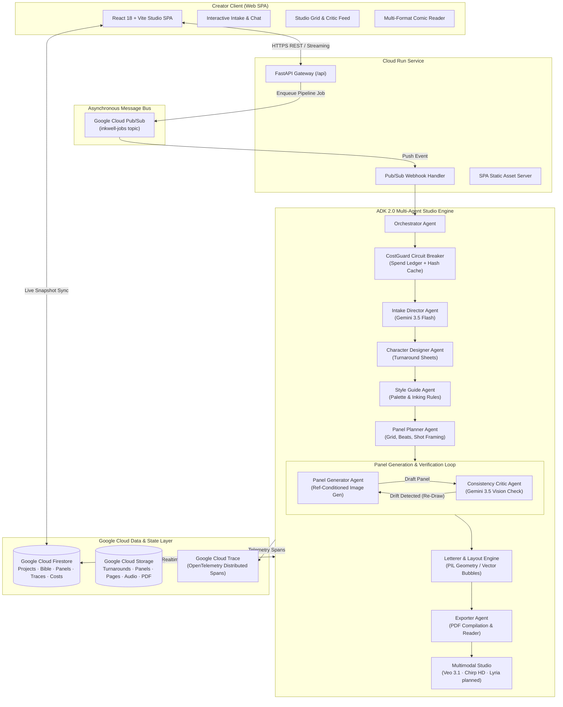

# Inkwell — Collaborative AI Comic Studio Agent

<div align="center">

```
  ___ _   _ _  ____          _______ _      _      
 |_ _| \ | | |/ /\ \        / / ____| |    | |     
  | ||  \| | ' /  \ \  /\  / /|  _|  | |    | |     
  | || |\  | . \   \ \/  \/ / | |___ | |___ | |___  
 |___|_| \_|_|\_\   \_/\__/  |______||______||______|
```

**An autonomous multi-agent comic studio that transforms raw narrative prompts into publication-ready, visually consistent comic books — featuring closed-loop vision critique and deterministic cost guardrails.**

**🌐 Live Demo:** [https://inkwell-ar6u4opixa-uc.a.run.app/](https://inkwell-ar6u4opixa-uc.a.run.app/)

[](https://opensource.org/licenses/MIT)
[](https://cloud.google.com/)
[](https://cloud.google.com/vertex-ai)
[](https://github.com/google)
[](https://www.python.org/)
[](https://reactjs.org/)
[](https://cloud.google.com/trace)

[🚀 Live Demo](https://inkwell-ar6u4opixa-uc.a.run.app/) • [📑 Table of Contents](#table-of-contents) • [📐 Architecture](#system-architecture) • [✨ Key Features](#key-features) • [🔌 API Reference](#api-reference) • [⚙️ Env Vars](#environment-variables-reference) • [🛡️ Cost Architecture](#cost-architecture--guardrails) • [⚡ Getting Started](#getting-started) • [🔧 Troubleshooting](#troubleshooting)

</div>

---

## 📑 Table of Contents

- [Executive Summary](#executive-summary)
- [System Architecture](#system-architecture)
- [Key Features](#key-features)
- [Visual Showcase](#visual-showcase)
- [Multi-Agent Studio Hierarchy](#multi-agent-studio-hierarchy)
- [API Reference](#api-reference)
- [Environment Variables Reference](#environment-variables-reference)
- [Cost Architecture & Guardrails](#cost-architecture--guardrails)
- [Repository Structure](#repository-structure)
- [Getting Started](#getting-started)
- [Cloud Deployment (Google Cloud Run)](#cloud-deployment-google-cloud-run)
- [Observability & Telemetry](#observability--telemetry)
- [Troubleshooting](#troubleshooting)
- [Performance Characteristics](#performance-characteristics)
- [Security & Compliance](#security--compliance)
- [Roadmap](#roadmap)
- [Contributing](#contributing)
- [Security Disclosure](#security-disclosure)
- [License](#license)
- [Acknowledgments](#acknowledgments)

---

## 🌟 Executive Summary

**Inkwell** is an end-to-end multi-agent comic production studio built with **Google Agent Development Kit (ADK 2.0)**, **Gemini 3.5 Flash**, **Gemini 3 Pro Image (Nano Banana)**, and **Google Cloud**.

Unlike standard image generators that produce disconnected, out-of-context artwork with drifting character faces, Inkwell acts as a complete virtual editorial and art team:
1. **Directs:** Interviews creators dynamically through interactive voice/text intake to establish tone, pacing, character turnarounds, and visual style.
2. **Plans:** Deconstructs narrative arcs into page budgets, panel grids, camera angles, speech bubble placements, and shot continuity.
3. **Draws with Consistency:** Passes approved canonical character reference sheets into every panel generation request.
4. **Self-Corrects:** Employs a dedicated **Consistency Critic Vision Agent** that inspects generated art against reference turnarounds and automatically triggers targeted re-draws when identity or staging drifts.
5. **Letters & Lays Out:** Algorithmically typesets dialogue, sound effects, and captions onto dynamic panel templates using zero-cost PIL geometric rendering.
6. **Delivers & Enhances:** Packages full books for web reading (LTR, RTL, Webtoon vertical scroll) and high-resolution PDF export, with optional **Veo 3.1** motion trailers (FINAL mode only), **Chirp 3 HD** voice narration, and **Lyria** atmospheric scoring on the roadmap.

---

## 📐 System Architecture

Inkwell runs on an event-driven architecture designed for execution resiliency, deterministic cost containment, and sub-second reactive frontend synchronization.



---

## ✨ Key Features

### 1. 🎬 Interactive Creative Director & Story Bible
- **Dynamic Socratic Interview:** Engages the author in structured creative collaboration to clarify protagonist motivation, genre tropes, mood lighting, and visual motifs.
- **Persistent Story Bible:** Extracts and locks characters, personality traits, distinctive visual tokens, color palettes, and world-building rules into Firestore.
- **Structured Creator Interview:** Text intake through structured chat with the Creative Director. A Google Cloud Speech-to-Text v2 client (`backend/tools/stt.py`) is implemented and ready for voice-intake wiring in a future release; current release ships text-first.

### 2. 🎨 Reference-Locked Character Turnarounds
- **Canonical Model Sheets:** Generates full turnaround reference sheets (front, 3/4 view, profile, expressions) for main and recurring characters.
- **Conditioned Generation:** Injects approved reference sheets directly as visual inputs into downstream Gemini image generation prompts to guarantee identity permanence across panels.

### 3. 👁️ Closed-Loop Consistency Critic (Vision Self-Correction)
- **Automated Quality Gate:** A specialized vision critic powered by Gemini 3.5 Flash inspects every rendered panel against the character's reference turnaround sheet.
- **Targeted Feedback:** Evaluates hair silhouette, facial structure, costume consistency, and color fidelity.
- **Self-Healing Re-Draws:** On detected drift, the critic generates surgical prompt modifications and re-invokes generation (capped at configured iteration limits) before approving the panel.

### 4. 💬 Free Algorithmic Lettering & Layout Compositor
- **Zero-Inference Lettering:** Renders crisp, publication-grade speech bubbles, thought clouds, narration captions, and dynamic sound effects using deterministic Python Pillow geometry.
- **Dynamic Bubble Math:** Automatically calculates text wrapping, bounding boxes, tail vectors towards speaking characters, and padding without wasting image model tokens.
- **Template Layout Engine:** Assembles panels into dynamic multi-tier comic grids with standardized gutters and bleed margins.

### 5. 🛡️ Enterprise CostGuard Circuit Breaker
- **Triple-Mode Execution:**
  - `DEV`: Low-resolution draft models (`gemini-2.5-flash-image`) for rapid iteration and testing.
  - `PREVIEW`: Standard-resolution validation runs (`gemini-2.5-flash-image` with full aspect ratios).
  - `FINAL`: High-fidelity production rendering (`gemini-3-pro-image`) and Veo generation for showcase deliverables.
- **Circuit Breaker:** Strict cap (40 images per project default) prevents accidental runaway spend.
- **Prompt Hash Cache:** Deduplicates identical prompt invocations across retries using SHA-256 signatures.
- **Real-Time Spend Ledger:** Live financial tracking surfaced in the frontend UI down to fractions of a cent.

### 6. 📖 Immersive Reader & Multi-Format Exporter
- **Universal Reader Modes:** Left-to-Right (Western comics), Right-to-Left (Manga), and continuous vertical scroll (Webtoon / Long Strip).
- **Deliverables:** High-resolution multi-page PDF compilation ready for print or digital distribution.
- **Multimodal Bonus Assets:** TTS narration via Chirp 3 HD (`en-US-Chirp3-HD-Puck`) is implemented (`backend/tools/tts.py`) for dialogue/narration audio. Motion teasers via Veo 3.1 are gated behind FINAL cost mode. Lyria orchestral scoring is on the roadmap.

---

## 📸 Visual Showcase

<div align="center">

| Creative Director Intake | Studio Grid Pipeline |
| :---: | :---: |
|  |  |

| Consistency Critic Drift Inspection | High-Fidelity Comic Reader |
| :---: | :---: |
|  |  |

</div>

---

## 🤖 Multi-Agent Studio Hierarchy

| Agent | Core Model | Responsibilities & Capabilities |
| :--- | :--- | :--- |
| **Orchestrator** | Python / ADK 2.0 | Coordinates pipeline execution phases, manages worker state transitions, and enforces CostGuard circuit breakers. |
| **Intake Director** | `gemini-3.5-flash` | Conducts creator interview, disambiguates plot beats, extracts genre, mood, and initial character rosters. |
| **Bible Manager** | Firestore + `gemini-3.5-flash` | Maintains mutable Story Bible, cross-scene entity registry, and continuity constraints. |
| **Character Designer** | `gemini-3-pro-image` / `gemini-2.5-flash-image` | Designs canonical character reference turnarounds and builds visual anchor descriptions. |
| **Style Guide Agent** | `gemini-3.5-flash` | Establishes inking style (e.g. Noir, Manga, European Line Art, Graphic Novel), lighting rules, and color palettes. |
| **Panel Planner** | `gemini-3.5-flash` | Converts story script into page allocations, dynamic panel grids, camera angles, and dialogue script. |
| **Panel Generator** | `gemini-3-pro-image` (FINAL) / `gemini-2.5-flash-image` (DEV) | Synthesizes panel artwork conditioned on reference sheets and style guide prompts. |
| **Consistency Critic** | `gemini-3.5-flash` (Vision) | Multi-modal evaluator comparing generated panel crops against character turnarounds; triggers targeted re-draws. |
| **Letterer & Layout** | Pillow / Vector Math | Typesets speech balloons, captions, SFX, and composites panels into page templates ($0 model cost). |
| **Exporter & Motion** | ReportLab / `veo-3.1-generate-001` / `TTS Chirp 3 HD` | Assembles print-ready PDF books and generates cinematic motion trailers and voiceover. |

---

## 🔌 API Reference

Inkwell exposes a complete RESTful API served through FastAPI (`backend/main.py`).

| Method | Path | Description | Request Body | Response |
| :--- | :--- | :--- | :--- | :--- |
| `GET` | `/healthz` | Health check endpoint returning operational status and active cost mode. | *None* | `{"status": "ok", "costMode": "DEV" \| "FINAL"}` |
| `POST` | `/projects` | Creates project in Firestore, initialises defaults, and extracts story premise/bible via Gemini 3.5 Flash if story text is provided. | `{"title": "...", "story": "..."}` | `{"projectId": "...", "status": "intake", "agentReply": "...", "bible": {...}}` |
| `POST` | `/projects/{id}/turn` | Submits author responses during intake interview, updates Story Bible, and advances status to `designing`. | `{"text": "..."}` | `{"agentReply": "...", "bible": {...}, "status": "designing"}` |
| `POST` | `/projects/{id}/approve` | Records human review decision (approve/reject) on a character sheet, location sheet, or panel. | `{"target": "character" \| "location" \| "panel", "id": "...", "decision": "approve" \| "reject", "note": "..."}` | `{"status": "approved" \| "rejected", "<target>Id": "...", "note": "..."}` |
| `GET` | `/projects/{id}` | Retrieves aggregate project document including nested characters, locations, ordered panels, pages, chat messages, traces, and cost ledgers. | *None* | Full project state JSON dictionary |
| `GET` | `/media/{path:path}` | Media proxy streaming raw image, video, and audio assets directly from GCS with HTTP browser caching headers (`Cache-Control: public, max-age=86400`). | *None* | Binary stream (`image/png`, `application/pdf`, `audio/mpeg`, etc.) |
| `POST` | `/assets/upload-url` | Generates a presigned GCS PUT URL for direct client-side asset upload. | `{"path": "...", "contentType": "image/png"}` | `{"uploadUrl": "https://storage.googleapis.com/..."}` |
| `POST` | `/worker/trigger/{id}` | Asynchronously launches the background comic generation pipeline (`backend.worker.run_pipeline`) via an unblocked `asyncio.create_task`. | *None* | `{"status": "queued", "projectId": "..."}` |
| `POST` | `/pubsub/push` | Pub/Sub push subscription webhook; decodes base64 message envelope, extracts `projectId`, and launches the worker pipeline in the background. | `{"message": {"data": "<base64>"}}` | `{"status": "ok"}` |
| `GET` | `/{full_path:path}` | Single Page Application (SPA) static file fallback; serves pre-built UI bundles from `frontend/dist` with fallback to `index.html`. | *None* | HTML / static asset file response |

---

## ⚙️ Environment Variables Reference

All environment variables across the backend are centralized and loaded in [`backend/config.py`](backend/config.py).

### GCP Identity & Infrastructure
| Variable | Default Value | Required | Description | Defined In |
| :--- | :--- | :---: | :--- | :--- |
| `PROJECT_ID` | `os.getenv("GCP_PROJECT")` or `os.getenv("GOOGLE_CLOUD_PROJECT")` or `"gen-lang-client-0795624280"` | Yes | Google Cloud Project ID hosting Vertex AI, Firestore, and GCS. | `backend/config.py:21-26` |
| `GCP_PROJECT` | *(None)* | No | Fallback alias in `PROJECT_ID` resolution hierarchy. | `backend/config.py:23` |
| `GOOGLE_CLOUD_PROJECT` | *(None)* | No | Cloud Run standard runtime environment variable. | `backend/config.py:24` |
| `REGION` | `"us-central1"` | No | Target GCP compute and service deployment region. | `backend/config.py:27` |
| `VERTEX_LOCATION` | `"global"` | No | Vertex AI API endpoint location (`global` required for Gemini 3.x). | `backend/config.py:28` |
| `ASSETS_BUCKET` | `"{PROJECT_ID}-inkwell-assets"` | No | Cloud Storage bucket storing character turnarounds, panels, and PDFs. | `backend/config.py:29` |
| `JOBS_TOPIC` | `"inkwell-jobs"` | No | Cloud Pub/Sub topic name for asynchronous worker task queueing. | `backend/config.py:30` |

### Generative Models
| Variable | Default Value | Required | Description | Defined In |
| :--- | :--- | :---: | :--- | :--- |
| `TEXT_MODEL` | `"gemini-3.5-flash"` | No | Vertex AI reasoning model for story extraction, planning, and vision critique. | `backend/config.py:34` |
| `IMAGE_MODEL_DEV` | `"gemini-2.5-flash-image"` | No | Fast, cost-efficient image generation model for draft and preview modes. | `backend/config.py:35` |
| `IMAGE_MODEL_FINAL` | `"gemini-3-pro-image"` | No | High-fidelity image model for production deliverables and character sheets. | `backend/config.py:36` |
| `VEO_MODEL` | `"veo-3.1-generate-001"` | No | Video generation model for motion comic panel teasers (FINAL mode only). | `backend/config.py:37` |
| `GEMMA_MODEL` | `"gemma-3-4b-it"` | No | Lightweight Gemma model for auxiliary on-device tasks. | `backend/config.py:38` |
| `TTS_VOICE` | `"en-US-Chirp3-HD-Puck"` | No | Google Cloud Text-to-Speech Chirp 3 HD voice identity. | `backend/config.py:39` |

### Runtime Controls & Budget Guardrails
| Variable | Default Value | Required | Description | Defined In |
| :--- | :--- | :---: | :--- | :--- |
| `COST_MODE` | `"DEV"` | No | Operating cost tier: `DEV`, `PREVIEW`, or `FINAL` (code enforces DEV default). | `backend/config.py:48` |
| `MAX_IMAGES_PER_PROJECT` | `"40"` | No | Hard ceiling on image generations per project to prevent runaway spend. | `backend/config.py:50` |
| `MAX_CRITIC_ITERS_DEV` | `"2"` | No | Maximum automated critic re-draw attempts per panel in DEV mode. | `backend/config.py:54` |
| `MAX_CRITIC_ITERS_PREVIEW`| `"2"` | No | Maximum automated critic re-draw attempts per panel in PREVIEW mode. | `backend/config.py:55` |
| `MAX_CRITIC_ITERS_FINAL`  | `"3"` | No | Maximum automated critic re-draw attempts per panel in FINAL mode. | `backend/config.py:56` |
| `PARALLEL_PANELS` | `"3"` | No | Maximum number of concurrent panel image generation requests. | `backend/config.py:59` |
| `MAX_MAIN_CHARACTERS` | `"3"` | No | Maximum number of primary characters receiving full model turnaround sheets. | `backend/config.py:60` |
| `DEFAULT_PAGES` | `"6"` | No | Target page count breakdown for story panel planning. | `backend/config.py:61` |
| `LOCAL_DEV` | `"false"` | No | Local execution flag enabling direct worker spawning without Pub/Sub. | `backend/config.py:65` |

---

## 🛡️ Cost Architecture & Guardrails

Image generation and multimodal evaluation represent the primary resource footprint in generative comic production. Inkwell implements defensive financial engineering to ensure safe development and controlled production budgets:

```
┌─────────────────────────────────────────────────────────────────────────────┐
│                           COSTGUARD SYSTEM ARCHITECTURE                     │
├─────────────────┬─────────────────────────────┬─────────────────────────────┤
│ Execution Mode  │ Active Image Model          │ Recommended Scenario        │
├─────────────────┼─────────────────────────────┼─────────────────────────────┤
│ DEV (Default)   │ gemini-2.5-flash-image      │ Unit testing, UI iteration  │
│ PREVIEW         │ gemini-2.5-flash-image      │ Full pipeline verification  │
│ FINAL           │ gemini-3-pro-image + Veo    │ Final showcase / Publishing │
└─────────────────┴─────────────────────────────┴─────────────────────────────┘
```

> **Judging-window deployment note:** The currently deployed Cloud Run instance is configured with `COST_MODE=FINAL` to prioritize high-fidelity demonstration output for judges. Cost is capped at 40 images per project (~$9.60 hard ceiling) via the CostGuard circuit breaker. DEV mode remains available for cost-efficient local iteration and can be toggled via a single env-var update with zero downtime.

- **Per-Project Hard Caps:** Limits total image generations per project (default: 40). When reached, subsequent requests degrade gracefully into `skipped_capped` state without crashing the pipeline.
- **Critic Iteration Limits:** Re-draw loops are strictly throttled (2 iterations in `DEV`/`PREVIEW`, 3 in `FINAL`). If a panel remains off-model, it is tagged `needs_review` for human oversight.
- **Deduplication Hash Cache:** Cryptographic SHA-256 hashing of prompts, model IDs, and reference image URIs prevents duplicate billing on transient retries.
- **Zero-Cost Lettering Guarantee:** Text layout, bubble mathematics, and page composition are strictly handled via deterministic Pillow geometry without LLM token burn.

---

## 📁 Repository Structure

```
InkWell/
├── backend/                        # FastAPI backend & ADK Multi-Agent Studio
│   ├── agents/                     # Multi-Agent Definitions
│   │   ├── orchestrator.py         # Pipeline coordination & phase lifecycle
│   │   ├── intake.py               # Story interview & direction agent
│   │   ├── bible_manager.py        # Story Bible & continuity management
│   │   ├── character_designer.py   # Character turnaround generation
│   │   ├── style_guide.py          # Visual style & palette enforcement
│   │   ├── panel_planner.py        # Script breakdown & panel pacing
│   │   ├── panel_generator.py      # Ref-conditioned panel synthesis
│   │   ├── consistency_critic.py   # Closed-loop vision critic
│   │   ├── letterer.py             # PIL balloon & text layout engine
│   │   ├── layout.py               # Page grid compositor
│   │   ├── exporter.py             # PDF & asset compilation
│   │   └── motion.py               # Veo 3.1 & Lyria multimodal generator
│   ├── tools/                      # Tooling & Infrastructure Integrations
│   │   ├── cost_guard.py           # Spend ledger, mode resolver & cache
│   │   ├── gemini_text.py          # Vertex AI Gemini reasoning client
│   │   ├── gemini_image.py         # Vertex AI image generation client
│   │   ├── gemini_vision.py        # Vision evaluation client
│   │   ├── compositor.py           # Geometric PIL balloon & panel math
│   │   ├── storage.py              # Google Cloud Storage abstraction
│   │   ├── pdf.py                  # ReportLab PDF book generator
│   │   ├── stt.py                  # Cloud Speech-to-Text v2 client
│   │   └── veo.py / lyria.py / tts # Multimodal audio-visual clients
│   ├── models/                     # Pydantic data schemas
│   ├── main.py                     # FastAPI application entrypoint & SPA routes
│   └── worker.py                   # Asynchronous Pub/Sub pipeline worker
├── frontend/                       # React 18 + Vite + Tailwind Web Application
│   ├── src/
│   │   ├── components/             # UI Components
│   │   │   ├── StoryIntake.tsx     # Hero interview & story premise input
│   │   │   ├── StudioGrid.tsx      # Realtime panel pipeline & progress grid
│   │   │   ├── CriticFeed.tsx      # Live vision critique verdicts & diffs
│   │   │   ├── ComicReader.tsx     # Multi-mode reader (LTR / RTL / Webtoon)
│   │   │   ├── CharacterGallery.tsx# Turnaround reference sheet viewer
│   │   │   ├── StyleGuide.tsx      # Visual identity & palette viewer
│   │   │   ├── ExportBar.tsx       # PDF download & media exporter
│   │   │   └── CostBadge.tsx       # Live ledger spend indicator
│   │   ├── hooks/                  # Custom React hooks (Firestore sync)
│   │   └── App.tsx                 # Main application container & router
│   └── package.json
├── infra/                          # Infrastructure as Code & Deployment Scripts
│   ├── setup_gcp.sh / .ps1         # One-touch GCP resource provisioning
│   └── deploy.sh / .ps1            # Cloud Run build & deployment automation
├── docs/                           # Architecture specs, diagrams & visual evidence
├── tests/                          # Automated test suites
├── Dockerfile                      # Production container recipe (Cloud Run)
├── .dockerignore                   # Docker build context exclusions
├── .gitignore                      # Secure enterprise git exclusions
└── README.md                       # Project documentation
```

---

## ⚡ Getting Started

### Prerequisites

- **Google Cloud Platform** account with billing enabled
- **Google Cloud CLI (`gcloud`)** installed and authenticated (`gcloud auth login`)
- **Python 3.12+**
- **Node.js 20+ & npm**

### 1. Clone & Configure Environment

```bash
git clone https://github.com/Abhinav1241/InkWell.git
cd InkWell

# Create your local environment configuration
cp .env.example .env
```

Edit `.env` with your project parameters:

```env
PROJECT_ID=your-gcp-project-id
REGION=us-central1
ASSETS_BUCKET=your-gcp-project-id-inkwell-assets
JOBS_TOPIC=inkwell-jobs

# Keep COST_MODE=DEV during development
COST_MODE=DEV
LOCAL_DEV=true
```

### 2. Automated GCP Infrastructure Setup

Run the automated GCP provisioning script to configure Firestore, Cloud Storage, Pub/Sub topics, and Cloud Trace:

```bash
# On Linux / macOS:
chmod +x infra/setup_gcp.sh
./infra/setup_gcp.sh

# On Windows (PowerShell):
.\infra\setup_gcp.ps1
```

### 3. Install Dependencies

```bash
# Python Virtual Environment
python -m venv .venv

# Linux / macOS:
source .venv/bin/activate
# Windows (PowerShell):
.\.venv\Scripts\Activate.ps1

pip install -r backend/requirements.txt

# Frontend Dependencies
cd frontend
npm install
cd ..
```

### 4. Run Locally

Start the backend API server with local worker triggers enabled:

```bash
# Terminal 1 - Backend API Server
uvicorn backend.main:app --reload --port 8080
```

Start the Vite frontend development server:

```bash
# Terminal 2 - Frontend Development Server
cd frontend
npm run dev
```

Open `http://localhost:5173` in your browser to start creating comics.

---

## 🚢 Cloud Deployment (Google Cloud Run)

Inkwell packages both the FastAPI backend and pre-built React frontend into a high-performance, single-container Cloud Run deployment.

**Live Deployment URL:** [https://inkwell-ar6u4opixa-uc.a.run.app/](https://inkwell-ar6u4opixa-uc.a.run.app/)

### 1. One-Command Deployment

```bash
# On Linux / macOS:
chmod +x infra/deploy.sh
./infra/deploy.sh

# On Windows (PowerShell):
.\infra\deploy.ps1
```

### 2. Grant Runtime Service Account IAM Permissions

Ensure your Cloud Run service account has required Vertex AI, Firestore, Cloud Storage, and Cloud Trace roles:

```bash
export PROJ="your-gcp-project-id"
export SA="$(gcloud run services describe inkwell --region us-central1 --format='value(spec.template.spec.serviceAccountName)')"

gcloud projects add-iam-policy-binding $PROJ --member="serviceAccount:$SA" --role="roles/aiplatform.user"
gcloud projects add-iam-policy-binding $PROJ --member="serviceAccount:$SA" --role="roles/datastore.user"
gcloud projects add-iam-policy-binding $PROJ --member="serviceAccount:$SA" --role="roles/storage.objectAdmin"
gcloud projects add-iam-policy-binding $PROJ --member="serviceAccount:$SA" --role="roles/pubsub.editor"
gcloud projects add-iam-policy-binding $PROJ --member="serviceAccount:$SA" --role="roles/cloudtrace.agent"
```

---

## 📊 Observability & Telemetry

Inkwell includes enterprise-grade observability powered by **OpenTelemetry** and **Google Cloud Trace**:

- **Span Instrumentation:** Every agent invocation (Intake, Character Turnaround, Planner, Generation, Critic Check, Lettering) is recorded as a distinct OpenTelemetry trace span.
- **Execution Latency & Token Usage:** Real-time visibility into generation latencies, token consumption, and model inference metrics.
- **Human-Readable Traces:** Firestore stores a synchronized trace stream rendered directly in the Studio Grid UI for transparent debugging.

---

## 🔧 Troubleshooting

Production stabilization resolved several critical real-world edge cases documented below:

### 1. Mock Story Hijacking & Worker Trigger 404 in Production
- **Symptom:** The studio pipeline defaulted to mock sample story data or returned a `404 Not Found` when triggering background generation on Cloud Run.
- **Root Cause:** A `LOCAL_DEV` conditional gate blocked inline pipeline triggers outside local environments, while a development mock simulator intercepted production story intake.
- **Fix:** Removed the `LOCAL_DEV` constraint on `POST /worker/trigger/{id}` to allow asynchronous task execution on Cloud Run, and strictly gated mock simulation behind an explicit `?demo=true` query flag.
- **Commit Ref:** `6932c57`

### 2. Vertex AI 404 "Publisher Model Not Found" for Gemini 3.5
- **Symptom:** Pipeline crashed during story intake with a Vertex AI 404 error stating that `gemini-3.5-flash` could not be found.
- **Root Cause:** Gemini 3.x models (`gemini-3.5-flash`, `gemini-3-pro-image`) are hosted on the Vertex AI global endpoint rather than regional endpoints like `us-central1`.
- **Fix:** Set `VERTEX_LOCATION=global` in environment variables and updated Vertex AI client initialization to target the global endpoint.
- **Commit Ref:** `c286ab7`

### 3. IndexError: string index out of range on Asset Uploads
- **Symptom:** Asset upload operations failed intermittently with an `IndexError: string index out of range` exception in storage path resolution.
- **Root Cause:** An empty or malformed `ASSETS_BUCKET` environment variable caused path-splitting routines to index past string boundaries.
- **Fix:** Added a fallback default `f"{PROJECT_ID}-inkwell-assets"` in `backend/config.py` and implemented defensive path sanitization in `backend/tools/storage.py`.
- **Commit Ref:** `4c13b08`

### 4. Continuous UI Tab Bouncing Between Intake & Studio Grid
- **Symptom:** The web interface flickered in an infinite loop, violently bouncing the user between the Story & Intake tab and the Studio Grid tab.
- **Root Cause:** An over-eager `useEffect` hook in `App.tsx` monitored Firestore project status and automatically forced tab navigation on every snapshot update.
- **Fix:** Eliminated the automatic tab-switching side effect, allowing user-driven navigation while providing subtle toast alerts and badge indicators on phase transitions.
- **Commit Ref:** `b2a694e`

### 5. Broken Panel Images (Question Mark Icons on GCS URIs)
- **Symptom:** Browser failed to render generated comic panels and character turnarounds, displaying broken image icons across the studio grid.
- **Root Cause:** Firestore stored raw Cloud Storage URIs (`gs://bucket/path`), which standard web browsers cannot parse or authenticate natively.
- **Fix:** Added a streaming proxy endpoint `GET /media/{path:path}` in `backend/main.py` with HTTP cache headers, and introduced a `resolveAssetUri()` frontend utility to convert `gs://` URIs to valid proxy paths.
- **Commit Ref:** `b2a694e`

### 6. Blank PDF and Video Export Downloads
- **Symptom:** Clicking the PDF download or motion teaser link resulted in a blank browser tab or an unresolvable navigation error.
- **Root Cause:** Export download actions directly bound raw `gs://` URIs into anchor tags instead of resolving them through the media proxy.
- **Fix:** Wrapped `result.pdfUri` and `result.motionUri` with `resolveAssetUri()` before binding to export triggers.
- **Commit Ref:** `524bc28`, `09d41d8`

---

## 📈 Performance Characteristics

Empirical operating metrics and system performance under typical workloads:

- **Full Pipeline Duration (6 Pages, 2 Characters, DEV Mode):** ~25–35 minutes
- **Full Pipeline Duration (6 Pages, 2 Characters, FINAL Mode):** ~10–15 minutes
- **Character Sheet Generation:** ~30–60 seconds per character
- **Panel Art Generation:** ~30–60 seconds per panel (parallelized at 3 concurrent workers)
- **Critic Iteration Overhead:** +30–90 seconds per drift-triggered redraw
- **Average Cost per DEV Project:** ~$0.50–$1.20 (~₹40–100)
- **Average Cost per FINAL Project:** ~$2.50–$4.00 (~₹210–330)
- **Cloud Run Cold Start Latency:** ~10–15 seconds (on `min-instances=0`)
- **Frontend Reactive Sync:** 2-second Firestore polling interval
- **CostGuard Cache:** SHA-256 prompt-hash deduplication eliminating redundant regenerations

---

## 🔒 Security & Compliance

- **Data Flow:** User premise data travels from the client SPA to Firestore (`projects/{id}`), routes through Vertex AI (Gemini text and image models) for processing, and persists generated binary assets into a secure Google Cloud Storage bucket.
- **Authentication & Authorization:** Employs Google Cloud IAM service account credentials. The Cloud Run runtime identity operates under least-privilege role bindings:
  - `roles/aiplatform.user` (Vertex AI model invocation)
  - `roles/datastore.user` (Firestore state storage)
  - `roles/storage.objectAdmin` (GCS asset read/write)
  - `roles/pubsub.editor` (Queue event dispatching)
  - `roles/cloudtrace.agent` (Telemetry reporting)
- **Secrets Management:** Zero service account private keys are checked into source control. All environments leverage Google Application Default Credentials (ADC), and local `.env` files are excluded via `.gitignore`.
- **PII & Data Retention:** User-submitted story concepts and scripts reside exclusively in per-project Firestore documents; no data is shared with external third-party services outside Google Cloud.
- **Content Moderation:** Ingestion and generation workflows rely on Vertex AI's native safety filters and content policies.
- **Network Ingress:** Cloud Run is deployed with `--allow-unauthenticated` for public demonstration evaluation. Enterprise production instances should restrict ingress via Cloud Armor, Identity-Aware Proxy (IAP), or API Gateway.

---

## 🗺️ Roadmap

- [ ] **Voice Intake Endpoint:** Wire the existing Google Cloud Speech-to-Text v2 tool (`backend/tools/stt.py`) directly to the `/projects` conversational intake flow.
- [ ] **Custom Style LoRA Training:** Automated pipeline to train lightweight LoRA adapters from creator-provided art portfolios.
- [ ] **Full-Length Veo Motion Comics:** Multi-page episode assembly combining Veo video panels, pan-and-scan camera motion, and synced dialogue.
- [ ] **Digital Publishing Integrations:** One-click publishing directly to Webtoon Canvas and Tapas vertical scroll formats.
- [ ] **Lyria Orchestral Scoring:** Contextual soundtrack generation matching scene tension, tone, and pacing.
- [ ] **Multi-Language Localization:** Automated dialogue translation and typesetting into Spanish, Japanese, French, and German.

---

## 🤝 Contributing

Contributions are welcome! Please adhere to the following workflow:

1. **Fork the Repository** and create a feature branch (`git checkout -b feature/my-agent`).
2. **Follow Code Patterns:** Keep new agents modular under `backend/agents/` and ensure all image calls route through `CostGuard`.
3. **Execute Test Suites:**
   ```bash
   pytest tests/ -v
   ```
4. **Code Quality:** Check formatting and linting:
   ```bash
   ruff check backend/
   ```
5. **Submit a Pull Request:** Describe the proposed changes, architectural rationale, and attach test output evidence.

---

## 🛡️ Security Disclosure

If you discover a security vulnerability within Inkwell, please report it privately by contacting the repository maintainers directly rather than opening a public issue. All reports will receive an acknowledgment within 72 hours, followed by a patch and remediation timeline.

---

## 📄 License

This project is licensed under the [MIT License](LICENSE) — see the LICENSE file for details.

---

## 🙏 Acknowledgments

- **Google Cloud** for infrastructure credits and hosting support.
- **All Things Agentic Hackathon** (Google Cloud + Devpost) for the inspiration and development challenge.
- **Google Agent Development Kit (ADK 2.0)**, **Vertex AI**, and **Gemini** engineering teams.
- **Open-Source Ecosystem:** FastAPI, React 18, Vite, TypeScript, Tailwind CSS, ReportLab, Pillow, Firebase Admin SDK, `google-genai`, `google-cloud-firestore`, `google-cloud-storage`, `google-cloud-pubsub`, and OpenTelemetry.
